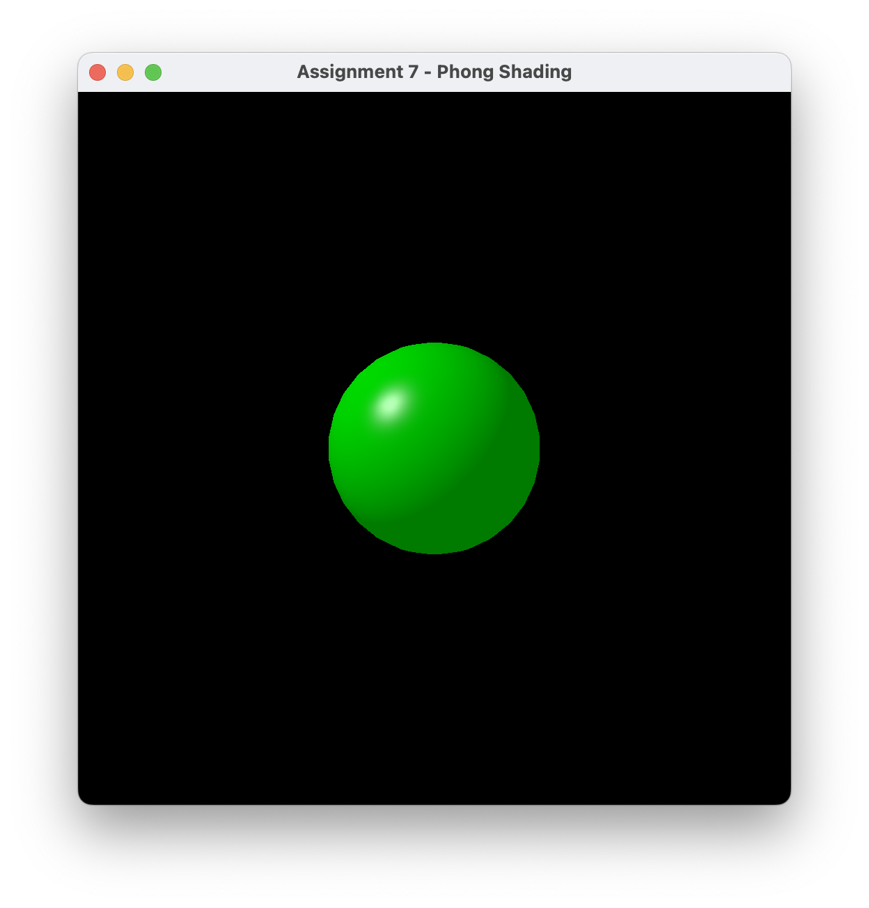

# Overview

This project renders a 3D sphere with Phong shading using OpenGL.  
It uses GLFW, GLEW, and GLM, and loads custom GLSL shaders for lighting effects.

# How to Compilation & Run

1. **Clone the Repository:**
   First, clone this repository to your local machine using Git.

2. **Open the Project in Visual Studio:**
   - Open Visual Studio and select `File` -> `Open` -> `Project/Solution`.
   - Navigate to the folder where you cloned the repository and open the project file (usually `.sln`).

3. **Build the Project:**
   - In Visual Studio, go to `Build` -> `Build Solution` or press `Ctrl + Shift + B` to compile the project.
  
4. **Set the Project as Startup Project:**
	- In the Solution Explorer, right-click the project you want to run.
	- Select `Set as Startup Project`.

5. **Run the Project:**
   - After the build is complete, run the project by selecting `Debug` -> `Start Debugging` or pressing `F5`.

# Result Screenshots

